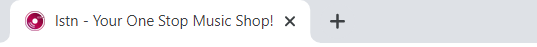

# WEBSITE - lstn
This is a website for a (made up) music related company named "lstn". 

## Features:
#### 1. Multiple Pages 
Within this web application, we have multiple pages and want to be able to navigate among the views that are rendered by these various pages. React Router was used for the routing, route matching and navigation.

#### 2. Reuse of Components
Custom Components (Button.js and CardItem.js) were created and reused, instead of writing the same code multiple times.

#### 3. Custom Logo
A custom logo of the store was added instead of using the one provided by default in React.

## Deployed At:
https://anushka-28.github.io/reactjs-website-lstn/

